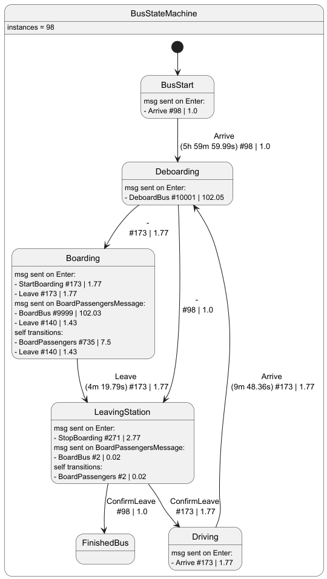
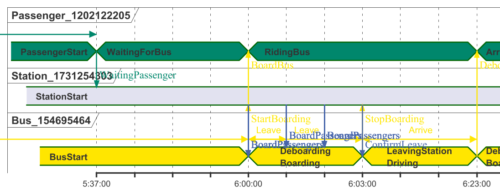
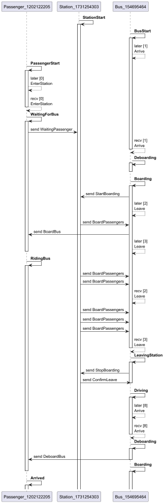
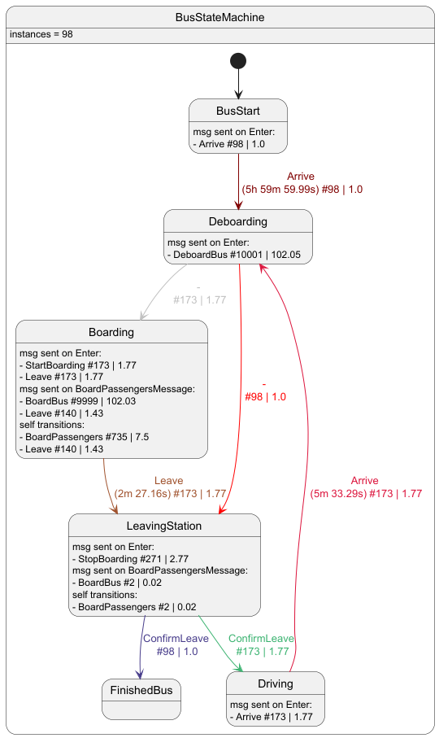
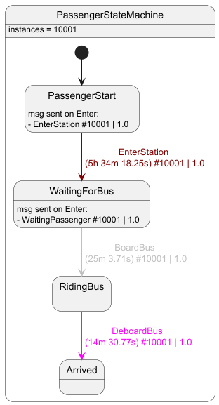
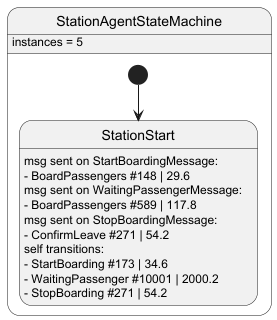

# State Machine System in mobiTopp

This document explains the agent/event/state machine system in mobiTopp and how to use the state machine builder.

## Table of Contents
- [Overview](#overview)
- [Core Components](#core-components)
  - [Agents](#agents)
  - [Events and Messages](#events-and-messages)
  - [State Machines](#state-machines)
  - [States](#states)
- [State Machine Builder](#state-machine-builder)
  - [Creating a State Machine](#creating-a-state-machine)
  - [Defining States](#defining-states)
  - [State Types](#state-types)
  - [Message Handling](#message-handling)
  - [State Transitions](#state-transitions)
- [Message Sending Mechanisms](#message-sending-mechanisms)
  - [Send Interface](#send-interface)
  - [Events and Message Delivery](#events-and-message-delivery)
- [Code Generation Annotations](#code-generation-annotations)
  - [StateCalled Annotation](#statecalled-annotation)
  - [MessageCalled Annotation](#messagecalled-annotation)
  - [Using Generated Code](#using-generated-code)
- [PlantUML Diagrams](#plantuml-diagrams)
  - [Record StateMachineUsage and AgentInteractions](#record-statemachineusage-and-agentinteractions)
  - [Render PlantUML diagrams](#render-plantuml-diagrams)
- [Examples](#examples)
  - [Basic State Machine](#basic-state-machine)
  - [Complex State Machine](#complex-state-machine)

## Overview

The state machine system in mobiTopp provides a flexible and powerful way to model agent behavior in simulations.
It is based on the concept of agents that process events and transition between states based on messages they receive.
This event-driven architecture allows for complex behaviors to be modeled in a clear and maintainable way.

## Core Components

### Agents

Agents are the core entities in the event-based simulation that process and send events. 
They can be thought of as actors in the simulation that have their own behavior and can interact with other agents.

There are two main types of agents:
- `Agent<M>`: The base interface for all agents, which can process events containing messages of type `M`.
- `StateBasedAgent<M>`: An agent implementation that uses a state machine to manage its behavior.

Agents have two primary methods:
- `init()`: Initializes the agent and returns any events produced during initialization.
- `processEvent(event)`: Processes an event and produces new events in response.

### Events and Messages

Events are the primary means of communication between agents. An event consists of:
- A sender agent
- A receiver agent
- A message (the content of the event)
- A send time
- A receive time

Messages are simple data structures that can be sent between agents. 
They implement the `Message` interface, which is a marker interface with no methods.

The system provides utilities for sending messages:
- `Send`: An interface for sending messages between agents.
- `SendScope`: An interface for creating a scope in which messages can be sent.

### State Machines

State machines manage the behavior of agents by controlling how they respond to events and when they transition between states.
The main components are:

- `StateMachine`: The interface for all state machines.
- `TransitoryStateMachine`: An implementation that handles transitory states (states that immediately transition to another state).
- `RecordingStateMachine`: An extension that records the history of states visited (useful for debugging).

State machines are created by `StateMachineFactory` implementations, 
which provide methods to create state machines for specific agent types.

### States

States define how agents respond to messages and when they should transition to other states. The main components are:

- `State`: The interface for all states.
- `StateData`: Data associated with a state, containing at least the current time and agent.
- `StateBehavior`: Defines the behavior of a state, including how it responds to messages and when it transitions.

## State Machine Builder

The state machine builder provides a DSL (Domain-Specific Language) for defining state machines in a clear and concise way.

### Creating a State Machine

To create a state machine, use the `stateMachine` function:

```kotlin
val factory = stateMachine<MyAgent>("MyStateMachine") {
    // Define states and transitions here
}
```

### Defining States

There are several types of states you can define:

1. **Start State**: The initial state of the state machine.
   ```kotlin
   start(MyStartState::class, initialize = { time, agent ->
       MyStartStateData(time, agent)
   }) {
        // Optional code to execute when entering this state
   }
   ```

2. **Reactive State**: A state that responds to messages but doesn't automatically transition.
   ```kotlin
   state(MyState::class) { send ->
       // Optional code to execute when entering this state
   }
   ```

3. **Transitory State**: A state that immediately transitions to another state.
   ```kotlin
   transState(MyTransState::class) { send ->
       // Optional code to execute when entering this state
   }.next { send ->
       // Return the next state data
       MyNextStateData(time, agent)
   }
   ```

4. **Final State**: A state that represents the end of a state machine.
   ```kotlin
   finState(MyFinalState::class) { send ->
       // Optional code to execute when entering this state
   }
   ```

### State Types

Each state needs a corresponding state data class that extends `StateData`. 
This class holds the state variables and data associated with the state.

```kotlin
class MyStateData(
    time: AbsoluteTime,
    override val agent: MyAgent
) : BaseStateData(time)
```

### Message Handling

You can define how 'reactive' states (non-transitory and non-final states) respond to messages using the `on` and `transitionOn` methods:

- `on`: Handles a message without transitioning to another state.
  ```kotlin
  on(MyMessage::class) { message, send ->
      // Handle the message
  }
  ```

- `transitionOn`: Handles a message and may transition to another state.
  ```kotlin
  transitionOn(MyMessage::class) { message, send ->
      // Handle the message
      // Return the next state data or null if no transition
      if (someCondition) MyNextStateData(time, agent) else null
  }
  ```

### State Transitions

There are several ways to define state transitions:

1. **Message-triggered transitions**: Using `transitionOn` as shown above.

2. **Conditional transitions**: Using `transitionIf`.
   ```kotlin
   transitionIf({ someCondition() }) { send ->
       // Return the next state data
       MyNextStateData(time, agent)
   }
   ```

3. **Fallback transitions**: Using `checkTransition`.
   ```kotlin
   checkTransition { send ->
       // Return the next state data or null if no transition
       if (someCondition()) MyNextStateData(time, agent) else null
   }
   ```

4. **Mandatory transitions**: For transitory states, using `next`.
   ```kotlin
   next { send ->
       // Return the next state data
       MyNextStateData(time, agent)
   }
   ```

## Message Sending Mechanisms

The state machine system provides mechanisms for sending messages between agents through the `Send` interface,
which is available in all state definition scopes (enter, message handling, and transitions).

### Send Interface

The `Send` interface provides two primary methods for sending messages:

1. **`send` operator function**: Schedules a **message** to be delivered **to** a certain agent **at** a specific future time.
   ```kotlin
   send(message, to, at)
   ```
   - `message`: The message to send
   - `to`: The agent that should receive the message
   - `at`: The time at which the message should be delivered

2. **`send.now` function**: Schedules a **message** to be delivered immediately (the receive time equals the send time).
   ```kotlin
   send.now(message, to)
   ```
   - `message`: The message to send
   - `to`: The agent that should receive the message

### Events and Message Delivery

When you use `send` or `send.now`, the system creates an `Event` that includes:
- The sender agent (current agent)
- The send time (current time)
- The receiver agent
- The receive time (specified time for `send`, current time for `send.now`)
- The message content

These events are collected and returned from the state machine's processing methods, allowing the simulation to schedule their delivery at the appropriate times.

## Code Generation Annotations

The state machine system provides annotations that can generate boilerplate code, 
making it easier to define and use states and messages in a type-safe way.

### StateCalled Annotation

The `@StateCalled` annotation can be applied to StateData classes 
to generate convenience properties and functions for use in state machine definitions.

```kotlin
@StateCalled("StartBus")
class BusStartState(time: AbsoluteTime, bus: BusAgent) : BusState(time, bus)
```

This annotation generates:

1. The corresponding StateType as property with the name specified in the annotation:
   ```kotlin
   val StartBus = BusStartState::class
   ```

2. A factory function with the lowercase version of the name:
   ```kotlin
   fun startBus(time: AbsoluteTime, bus: BusAgent) = BusStartState(time, bus)
   ```

The annotation can also specify which states can transition to this state:

```kotlin
@StateCalled("Boarding", DeboardingState::class)
class BoardingState(state: BusState, deboardingCount: Int) : BusState(state)
```

### MessageCalled Annotation

Similarly, the `@MessageCalled` annotation can be applied to message classes:

```kotlin
@MessageCalled("Arrive")
class ArriveMessage : BusMessage
```

This generates:

1. A MessageType property:
   ```kotlin
   val Arrive = ArriveMessage::class
   ```

2. A factory function:
   ```kotlin
   fun arrive() = ArriveMessage()
   ```

The annotation can also specify which states can send this message:

```kotlin
@MessageCalled("BoardPassengers", StationStartState::class)
data class BoardPassengersMessage(val passengers: List<Passenger>) : BusMessage
```

### Using Generated Code

These generated properties and functions can be used in state machine definitions to create a cleaner, more readable syntax:

```kotlin
val busStateMachine = stateMachine<BusAgent>("BusStateMachine") {
    // Use the generated property in start()
    start(
        StartBus,  // Instead of BusStartState::class
        ::startBus // Instead of { time, agent -> BusStartState(time, agent) }
    ) { send ->
        // Use the generated function to create a message
        send(arrive(), bus, bus.departure)
    }.transitionOn(Arrive) { message, send ->  // Use the generated property
        deboarding()  // Use the generated function to create a state
    }

    // More state definitions...
}
```

This approach provides several benefits:
- Type safety: The compiler ensures that the correct types are used
- Readability: The code is more concise and expressive
- Maintainability: Changes to state or message classes are automatically reflected in the generated code


## PlantUML Diagrams
To visualize the configured dynamic agent behavior, the visited states visited and messages sent during the simulation 
can be recorded using a `RecordingStateMachine`. This is a special implementation of the `StateMachine` interface
that records every "enter state", "transition on message" and "fallback transition" event 
as well as all produced response messages.

### Record StateMachineUsage and AgentInteractions
To create a `RecordingStateMachine` a `RecordingStateMachineFactory` can be used. 
This factory wraps an arbitrary `StateMachineFactory` and reuses the logic for creating the initial state.
An existing `StateMachineFactory` can be wrapped using the extension function `withRecording`:

```kotlin
val recordingFactory = personStateMachineFactory.withRecording()
```

The `StateMachineUsage` is recorded globally in a static object: `RecordingStateMachine.stateMachineUsage` 
which collects aggregated usage statistics per unique state machine name.
Additionally `AgentInteractions` can be recorded, which consist of all individual state changes and messages of all agents.
Since this disaggregated form of recording is memory-heavy, it can optionally be activated and deactivated.
Activation and deactivation returns the recorded `AgentInteractions` since the previous record toggle 
or an empty `NullInteractionRecorder`.

```kotlin
RecordingStateMachine.recordInteractions()

// simulate here

val recordedInteraction = RecordingStateMachine.stopRecordingInteractions()
```

### Render PlantUML diagrams
After recording the `StateMachineUsage` or `AgentInteractions` of a simulation, 
the data can be rendered as PlantUML diagrams:

 - **State charts:** `StateMachineUsage` can be rendered as state charts. The default file path is `docs/state_machines/<NAME>.puml`. 
    ```kotlin
    RecordingStateMachine.stateMachineUsage.renderAsPumlStateCharts()
    ```

    <details>
     <summary>State charts semantics:</summary>
     Each diagram consists of a frame stating the name and number of observed instances of a state machine. 
     It contains all the observed states of the state machine. 
     Each state displays the various messages it sends in response to "enter state" and received messages.
     Also, the self-transitions are displayed as text in the state body instead of arrows, as they tend to overlap.
     A self-transition occurs when the state processes an event/message but does not transition to a new state 
     (`nextState == null`). It is possible that a state produces a new state object of the same type, 
     which does **not** constitute a self-transition. 
     Additionally to states, the diagrams contain arrows which represent state transitions. 
     They are labeled with the message that triggered the transition or "-" for fallback transitions 
     (e.g., in case of transitory states). Sent messages and transitions are labeled with the total number of occurrences 
     and the average number of occurrences per instance of the state machine (mostly = number of agents) `#420 | 0.42`.
     Transitions from non-transitory states are also labeled with the average time spent in the previous state 
     before the transition occurred:
   
     
    </details>

- **Timing diagram:** `AgentInteractions` can be filtered for a specific agent and rendered as timing diagrams. 
  The interaction filter recursively traverses the graph of agent-nodes and message vertices 
  up to a specified maximum recursion depth `maxDepth` starting at the given agent node.
  E.g., a `maxDepth` of `1` will plot all the agents the given agent sends/receives messages to/from.
  The default result file path is `docs/timing/<AGENT_NAME>.puml`.
  ```kotlin
  RecordingStateMachine.interactionRecorder.renderAsPumlTimingDiagram(agents[0], maxDepth=1)
  ```
  
  <details>
    <summary>Timing diagram semantics:</summary>
    Each agent is displayed in a separate row with a different color showing its state changes over time.
    Self messages are shown as "constraints (<->)" within the row, "<" marking the send time,
    ">" marking the receive time.
    Messages between agents are shown as arrows between the rows.
    
    
  </details>


- **Sequence diagram:** `AgentInteractions` can also be rendered as sequence diagrams. 
  Similar to timing diagrams, the interactions are filtered with a maximum interaction depth 
  starting from a given agent. The default result file path is `docs/sequence/<AGENT_NAME>.puml`.
  ```kotlin
  RecordingStateMachine.interactionRecorder.renderAsPumlSequenceDiagram(agents[0], maxDepth=1)
  ```
  
  <details>
  <summary>Sequence diagram semantics:</summary>
    Each agent is displayed as a column, activation/deactivation of its lifeline denotes entering / exiting a state. 
    The state name is displayed as a label on the arrow entering activating the state.
    Instantaneous messages are displayed as labeled arrows with the prefix "send".
    Delayed messages are displayed as dotted arrows with a "later" label prefix.
    At receive time of the delayed message the receiver has an addition dotted self-arrow with a "recv" label prefix.
    To identify which delayed send and receive belong together, they are marked with an index "[7]".
    
    
  </details>
  


## Examples

### Basic State Machine

Here's a simple example of a state machine for a traffic light:

```kotlin
// Define message types
@MessageCalled("ChangeLight")
object ChangeLightMessage : TrafficLightMessage()

// Define state data classes
@StateCalled("RedLight")
class RedLightData(time: AbsoluteTime, override val agent: TrafficLightAgent) : BaseStateData(time)

@StateCalled("YellowLight", RedLightState::class)
class YellowLightData(time: AbsoluteTime, override val agent: TrafficLightAgent) : BaseStateData(time)

@StateCalled("GreenLight", YellowLightState::class)
class GreenLightData(time: AbsoluteTime, override val agent: TrafficLightAgent) : BaseStateData(time)

// Create the state machine
val trafficLightFactory = stateMachine<TrafficLightAgent>("TrafficLight") {
    
    start(RedLight, ::redLight) { send ->
        // Schedule next light change
        send(changeLight(), self, time + 30.seconds)
    }.transitionOn(ChangeLight) { _, _ ->
        yellowLight()
    }

    state(YellowLight) { send ->
        // Schedule next light change
        send(changeLight(), self, time + 3.seconds)
    }.transitionOn(ChangeLight) { _, _ ->
        greenLight()
    }

    state(GreenLight) { send ->
        // Schedule next light change
        send(changeLight(), self, time + 27.seconds)
    }.transitionOn(ChangeLight) { _, _ ->
        redLight()
    }
}
```

### Complex Example

For a complex example see the state machine definitions of [this test case](https://github.com/kit-ifv/mobitopp/blob/main/src/test/kotlin/edu/kit/ifv/core/statemachine/TestExampleStates.kt):
 - [Bus Agents](https://github.com/kit-ifv/mobitopp/blob/main/src/test/kotlin/edu/kit/ifv/core/statemachine/BusTestAgent.kt) follow a schedule driving, from station to station picking up and dropping off passengers <details><summary>state diagram</summary></details>
 - [Passenger Agents](https://github.com/kit-ifv/mobitopp/blob/main/src/test/kotlin/edu/kit/ifv/core/statemachine/PassengerTestAgent.kt) travel from a start station to a destination station, beginning their trip at a certain time <details><summary>state diagram</summary></details>
 - [Station Agents](https://github.com/kit-ifv/mobitopp/blob/main/src/test/kotlin/edu/kit/ifv/core/statemachine/StationTestAgent.kt) communicate between passengers and buses, they allow passengers to wait and assign them to arrived buses that will travel to the agents desired destination <details><summary>state diagram</summary></details>